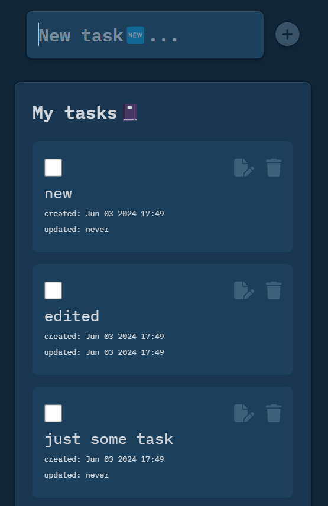

# To-do List

> This project showcases the implementation of a basic to-do list using Webpack. It offers a seamless and efficient task management experience, allowing users to easily create, organize, and complete tasks. With its sleek design and powerful functionality, this project demonstrates the potential of Webpack in building practical and intuitive web applications.

## Features:

1. Display an input field and a "Add Task" button where users can
add new tasks.
2. Display a list of tasks with options to edit, delete, and mark tasks
as completed. 
3. Implement functionality to edit tasks inline, i.e., users can click on
a task to edit its content. 
4. Allow users to mark tasks as completed, which should visually
differentiate completed tasks from pending tasks. 
5. Provide a "Delete Task" button for each task to allow users to
delete tasks. 
6. Use CSS to style the application and make it visually appealing. 7. Use JavaScript to handle task management logic, including adding, editing, deleting, and marking tasks 


## Built With

- HTML, CSS and JavaScript
- Webpack

## How to install

install package.json:

```sh
 cd to-do-list
 npm install
```
run webpack server:

```sh
 npm run start
```
run build command to compile to main.js

```sh
 npm run build
```

## Live Demo

Access the app [here](https://kaizipaul.github.io/to-do-list/dist)

## App Screenshot



## Authors

👤 **Paul Kaizirege Vedasto**

👤 **Ibrahim William Charles**

👤 **Charles Mngodo**

👤 **Amar Yakesh Jethwa**

👤 **Aslam Sumar Yusuf**


## 🤝 Contributing

Contributions, issues, and feature requests are welcome!

Feel free to check the [issues page](../../issues/).

## Show your support

Give a ⭐️ if you like this project!

## Acknowledgments

- Unique Academy

## 📝 License

This project is [MIT](./LICENSE) licensed.
